<div align="center">

# Parley

**Peer-to-peer video calling in the browser.**
Audio, video and chat travel directly between participants — never through a server.

[**Live demo →**](https://parley-taupe-phi.vercel.app)

[](https://parley-taupe-phi.vercel.app)
[](https://nextjs.org)
[](https://www.typescriptlang.org)
[](https://webrtc.org)
[](https://workers.cloudflare.com)
[](#testing)
[](#license)

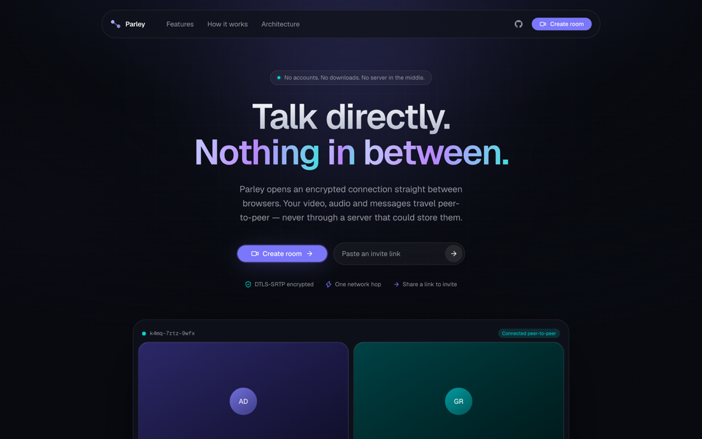

</div>

---

## Contents

- [The idea](#the-idea)
- [Features](#features)
- [Architecture](#architecture)
- [How a call is established](#how-a-call-is-established)
- [Perfect Negotiation](#perfect-negotiation)
- [Connection states](#connection-states)
- [Mesh topology](#mesh-topology)
- [Screen sharing](#screen-sharing)
- [Chat over data channels](#chat-over-data-channels)
- [Project structure](#project-structure)
- [Tech stack](#tech-stack)
- [Quick start](#quick-start)
- [Scripts](#scripts)
- [Environment variables](#environment-variables)
- [Testing](#testing)
- [Deployment](#deployment)
- [Browser support](#browser-support)
- [Known limitations](#known-limitations)
- [Roadmap](#roadmap)
- [License](#license)

---

## The idea

Most video products route your media through their servers, where it is decoded,
mixed and re-encoded. That is the correct engineering choice at scale — but it
means the operator sits inside your conversation.

Parley takes the other path: a **full mesh**, where every participant holds a
direct encrypted connection to every other participant. There is no media server,
so there is nothing in the middle to store, inspect or mix.

The cost is upload bandwidth, which is why rooms cap at six people. That trade-off
is deliberate and stated everywhere it matters, including in
[Known limitations](#known-limitations).

<table>
<tr>
<td width="50%">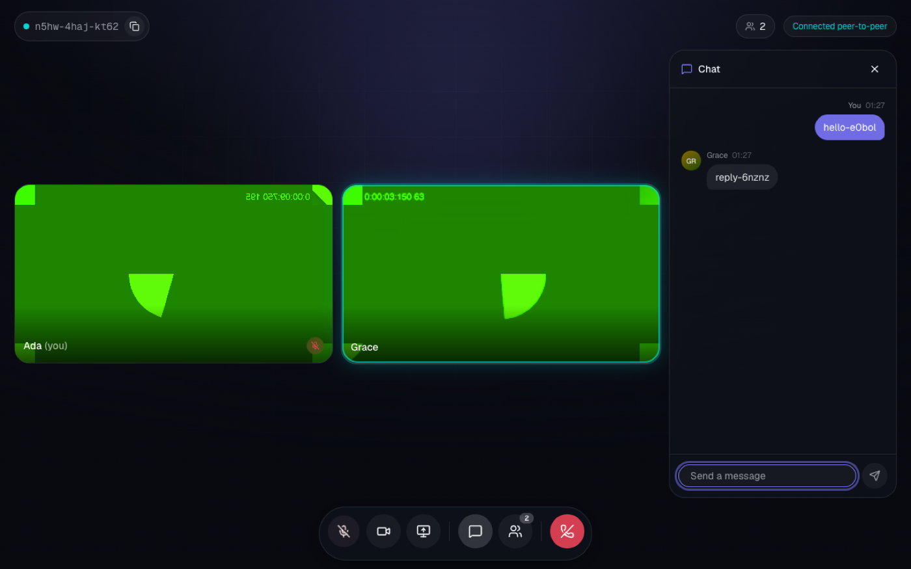</td>
<td width="50%">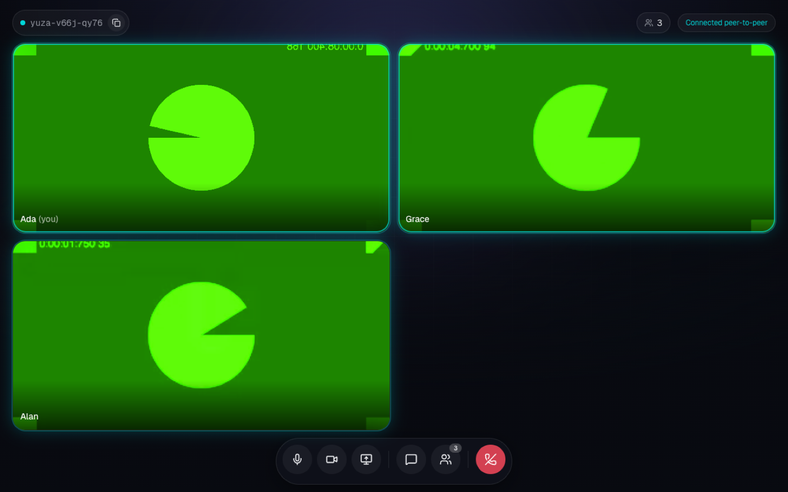</td>
</tr>
<tr>
<td align="center"><sub>Two-party call with data-channel chat</sub></td>
<td align="center"><sub>Three-party mesh, active speaker highlighted</sub></td>
</tr>
</table>

---

## Features

| | Feature | How it works |
|---|---|---|
| 🎥 | **Peer-to-peer video** | `RTCPeerConnection` per remote peer, DTLS-SRTP encrypted |
| 👥 | **Multi-party mesh** | Up to 6 participants, no SFU, no central mixer |
| 🖥️ | **Screen sharing** | `RTCRtpSender.replaceTrack()` — no renegotiation, no freeze |
| 💬 | **Chat** | WebRTC data channels, not a chat server |
| 🔊 | **Active speaker** | Web Audio RMS analysis of received streams |
| 🔗 | **Private rooms** | Unguessable 74-bit links, nothing persisted |
| 🎛️ | **Device switching** | Mid-call camera/mic swap, live `devicechange` handling |
| ♿ | **Accessible** | Keyboard shortcuts, ARIA, real `prefers-reduced-motion` support |
| 📱 | **Responsive** | 320px → 1920px, mobile safe-area aware |

### Advanced

| | Feature | How it works |
|---|---|---|
| 📊 | **Live diagnostics** | `RTCPeerConnection.getStats()` — RTT, jitter, loss, bitrate, codec, ICE candidate pair |
| 📁 | **P2P file transfer** | 16 KiB chunks over a second data channel, binary framed, backpressure-aware |
| 🖊️ | **Collaborative whiteboard** | Stroke deltas synced P2P in normalised coordinate space |
| 🎉 | **Reactions** | Ephemeral emoji over the data channel, GSAP-animated |
| ✋ | **Raise hand** | Synced state, surfaced on the tile and in the participant panel |
| 🔦 | **Spotlight** | GSAP Flip transition — tiles glide, never teleport |
| ⏺️ | **Local recording** | `MediaRecorder` with pause/resume; nothing leaves the device |
| 🎚️ | **Per-participant volume** | Local playback only — never mutes anyone for others |
| 📻 | **Push to talk** | Hold Space; ignores keystrokes while typing |
| 🧪 | **Device lab** | Camera/mic/speaker selection, tone test, real STUN connectivity probe |
| 📱 | **QR invite** | Generated client-side — the room link never reaches a third party |

<details>
<summary><b>More screens</b></summary>

<table>
<tr>
<td width="62%">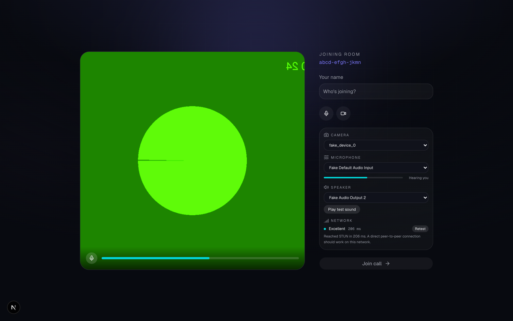</td>
<td width="38%">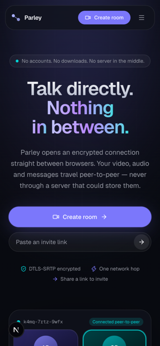</td>
</tr>
<tr>
<td align="center"><sub>Device lab — camera, mic level, speaker test, live STUN probe</sub></td>
<td align="center"><sub>Mobile, 375px</sub></td>
</tr>
<tr>
<td>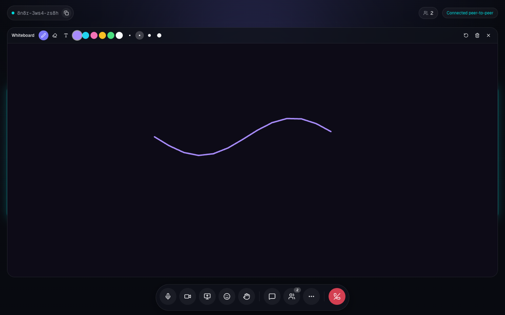</td>
<td>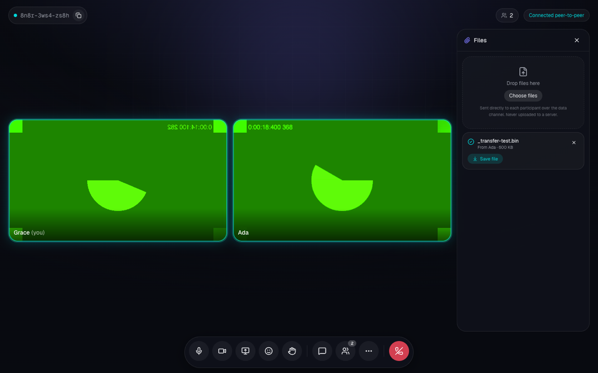</td>
</tr>
<tr>
<td align="center"><sub>Whiteboard — strokes replicate over the data channel</sub></td>
<td align="center"><sub>File transfer — chunked peer-to-peer, no upload</sub></td>
</tr>
</table>

The lobby exists for a reason beyond decoration: it is where the browser
permission prompt happens. Asking for camera access on a page that already shows
a preview frame gives the user context for the prompt.

</details>

---

## Architecture

<div align="center">
  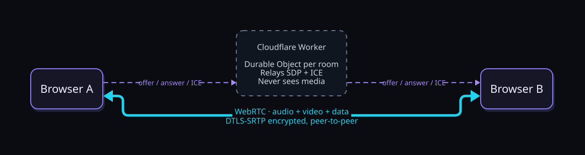
</div>

The system has **two phases**, and confusing them is the most common
misunderstanding about WebRTC:

| Phase | Duration | What moves | Through the server? |
|---|---|---|---|
| **Setup** | milliseconds | SDP offers/answers, ICE candidates | ✅ yes — relayed as JSON |
| **Call** | the whole session | audio, video, chat | ❌ **never** |

The signaling server exists only to introduce two browsers. Once they have found
a route to each other, it is idle — **if it went offline mid-call, the call would
continue uninterrupted.** Only new participants would be unable to join.

### Layers

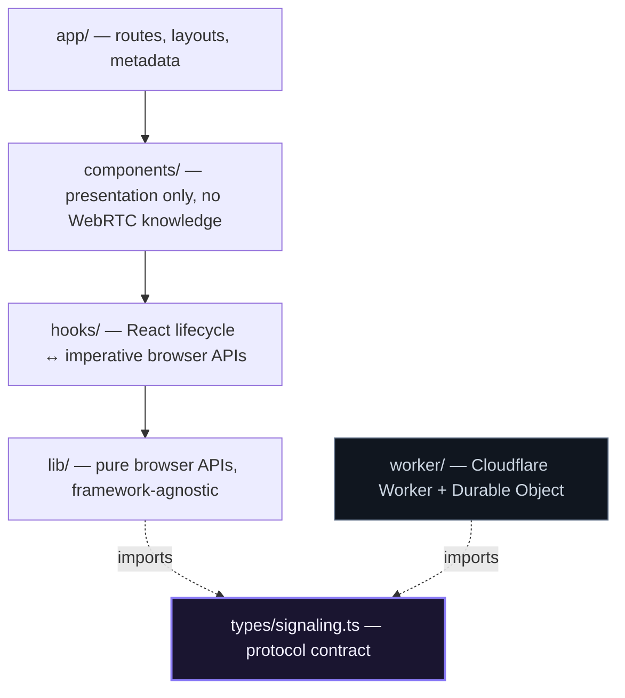

`types/signaling.ts` is imported by **both** the browser and the server, so a
change to a message shape breaks both builds at once instead of failing silently
at runtime. It deliberately contains **no DOM types** — the Workers runtime has no
DOM lib, so the protocol defines its own structural mirrors of
`RTCSessionDescriptionInit` and `RTCIceCandidateInit`.

---

## How a call is established

This is the sequence the whole product rests on.

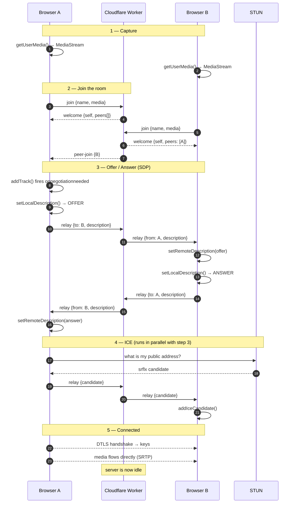

> **The subtle bug this design avoids.** ICE candidates routinely arrive *before*
> the offer they belong to, because signaling messages race. `addIceCandidate()`
> throws if there is no remote description yet, so Parley **queues** early
> candidates and flushes them after `setRemoteDescription()`. Skipping that queue
> produces calls that connect *most* of the time — far harder to diagnose than a
> consistent failure.

---

## Perfect Negotiation

If both peers offer at the same moment ("glare"), the connection wedges. Each peer
is assigned a role by comparing peer IDs, so both sides independently compute
**opposite, consistent** answers with zero extra signaling.

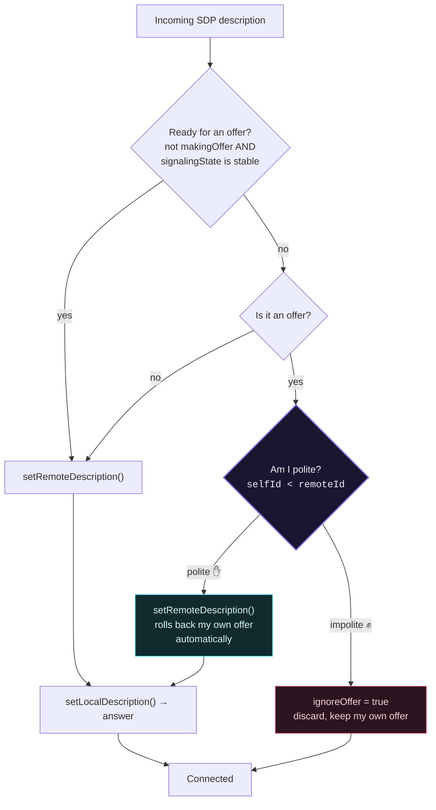

```ts
// lib/webrtc/peer.ts — roles are derived, never negotiated
this.polite = opts.selfId < opts.remoteId;
```

This matters far beyond the first connection: **every screen-share toggle
renegotiates.** Without this pattern, two people sharing simultaneously would
deadlock the call.

---

## Connection states

`RTCPeerConnection.connectionState` has six values; users only care about three
ideas. The mapping matters — showing "failed" for a transient blip would be both
wrong and alarming.

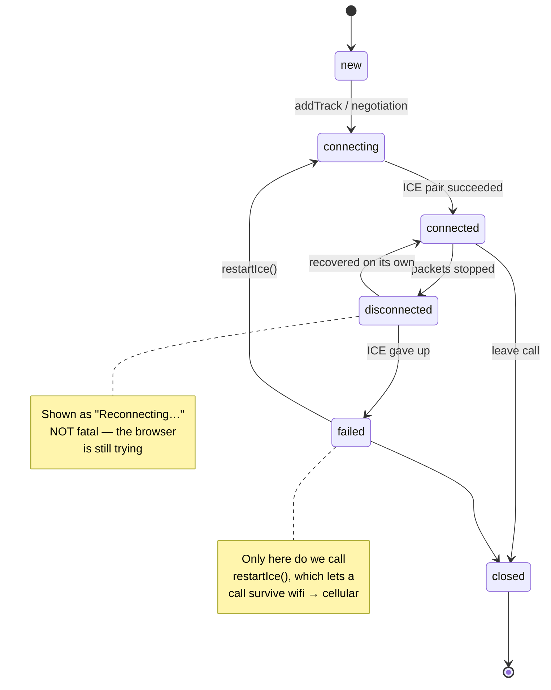

---

## Mesh topology

<div align="center">
  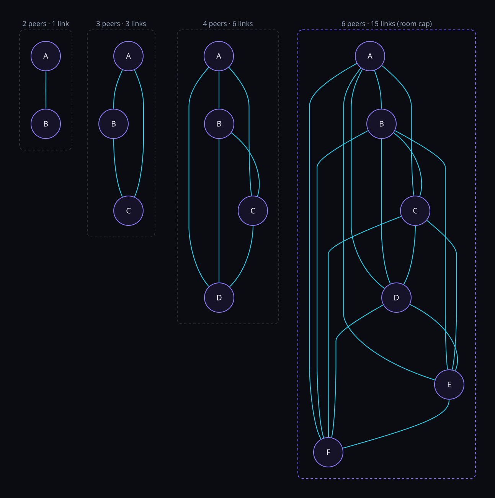
</div>

Connections grow as **`n(n-1)/2`**, and each browser uploads its own video
**`n-1`** times. At 720p that saturates a typical residential uplink around six
people — so `ROOM_CAPACITY = 6`.

The failure mode of exceeding it is ugly: everyone's quality degrades at once
rather than one clear error. Capping the room is the honest choice. Scaling past
it needs an **SFU**, where peers upload once to a server that forwards to
everyone — which trades away the privacy property that motivates this project.

---

## Screen sharing

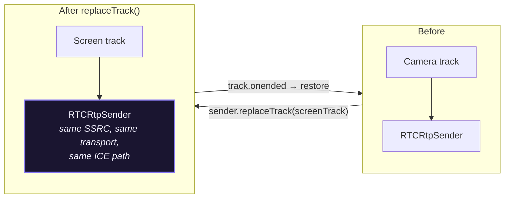

`addTrack()` returns an **`RTCRtpSender`** — the object that actually transmits.
`replaceTrack()` hot-swaps its source, so **no renegotiation happens** and the
remote `<video>` simply starts showing different pixels.

Two edge cases that bite:

1. **The browser draws its own "Stop sharing" bar** outside the page. Clicking it
   ends the track without telling your UI — you must listen for `track.onended`,
   or the app claims to be sharing a dead track.
2. **Dismissing the picker throws `NotAllowedError`.** That is a user *choice*,
   not a failure, so it must surface nothing.

The test suite asserts the remote track **id is unchanged** across a
share-and-restore cycle — proof the fast path is actually being taken.

---

## Chat over data channels

Chat rides the **same peer connection as media**, encrypted the same way. There is
no chat server.

```ts
// Both sides create the channel with the SAME id, out of band.
pc.createDataChannel("parley", { negotiated: true, id: 0, ordered: true });
```

With in-band channels only the offerer's channel exists until the answer arrives —
and under Perfect Negotiation you cannot be sure which side that is. Fixing the id
removes the `ondatachannel` race entirely.

> **The honest trade-off:** there is no history. A late joiner cannot see messages
> sent before they arrived, because nothing stored them. That is inherent to
> serverless chat, and the UI says so rather than hiding it.

---

## Diagnostics

The HUD reads `RTCPeerConnection.getStats()` once per second. Two details make
it non-trivial:

**1. Most counters are cumulative.** `bytesReceived` alone says nothing about
current bitrate, and lifetime `packetsLost` keeps displaying a blip from ten
minutes ago. Every figure shown is **differentiated against the previous
sample**, so loss can recover and bitrate reflects now.

**2. The report is a graph, not a list.** A codec name means reading
`inbound-rtp.codecId`, then looking that id up in the same map. Same for the
candidate pair behind the connection.

```
CALL HEALTH                 Excellent
Round trip                     42 ms
Jitter                        3.2 ms
Packet loss                    0.10 %

VIDEO            1280 × 720 · 30 fps
Bitrate                    2410 kbps
Codec                            VP9

TRANSPORT
Candidate pair          srflx ⇄ srflx
Path                          Direct
```

Polling only runs while the panel is open — `getStats()` is not free.

---

## Two data channels

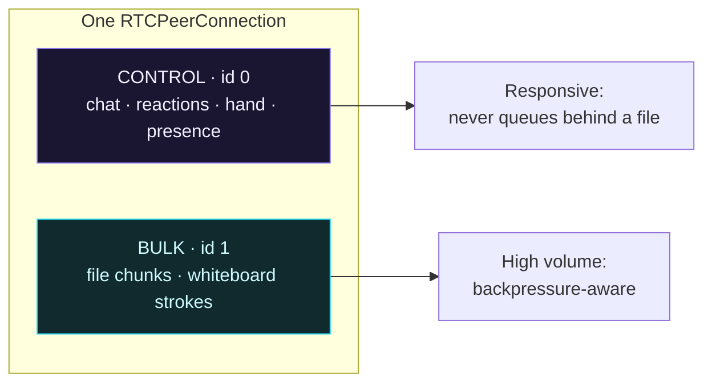

SCTP guarantees ordering **within** a channel, not across channels. A single
channel would make a chat message queue behind a 200 MB file transfer, so bulk
traffic gets its own.

### File transfer wire format

```
┌──────────────┬────────────────────────────┐
│ uint32 id LE │ payload (≤ 16 KiB)         │
└──────────────┴────────────────────────────┘
```

The 4-byte prefix lets interleaved chunks from several concurrent files be
routed without a channel per file. Binary rather than base64-in-JSON: base64
inflates payload ~33% and forces a string copy per chunk.

**Backpressure** is mandatory, not optional. `bufferedAmount` is what SCTP has
accepted but not yet sent; writing without checking it grows an unbounded queue
and eventually aborts the connection on a slow link. Sending pauses above 4 MB
and resumes on `bufferedamountlow`.

---

## Project structure

```
parley/
├── app/                        # Next.js App Router
│   ├── page.tsx                #   landing page
│   ├── r/[roomId]/page.tsx     #   room route (validates id, gates browser)
│   ├── error.tsx               #   route error boundary
│   └── globals.css             #   design tokens, glass/glow utilities
│
├── components/
│   ├── call/                   # video tile, grid, control dock, panels
│   ├── chat/                   # slide-out chat panel
│   ├── landing/                # hero, features, architecture walkthrough
│   ├── room/                   # lobby, waiting state, room orchestrator
│   ├── shared/                 # ambient background, logo, browser gate
│   └── ui/                     # ShadCN primitives
│
├── hooks/
│   ├── useLocalMedia.ts        # getUserMedia, devices, mute semantics
│   ├── useSignaling.ts         # typed WebSocket to the Worker
│   ├── useWebRTC.ts            # the mesh — peer map, tracks, data
│   ├── useScreenShare.ts       # getDisplayMedia + replaceTrack
│   ├── useChat.ts              # data-channel chat, dedupe, typing
│   ├── useAudioLevel.ts        # local mic level (lobby meter)
│   └── useActiveSpeakers.ts    # remote speaking detection
│
├── lib/
│   ├── webrtc/peer.ts          # PeerLink — Perfect Negotiation
│   ├── webrtc/config.ts        # ICE servers, STUN/TURN
│   ├── signaling/client.ts     # PartySocket wrapper
│   ├── media/errors.ts         # DOMException → human-readable failure
│   ├── media/devices.ts        # enumeration + constraints
│   ├── animations/             # GSAP system (motion, transitions, context)
│   └── room.ts                 # room ids, avatars, display name
│
├── worker/
│   ├── index.ts                # routes /parties/main/:room → Durable Object
│   └── room.ts                 # one DO per room, WebSocket hibernation
│
├── types/signaling.ts          # ⚠️ shared by browser AND worker
├── scripts/                    # test suite + screenshot harness
└── docs/                       # WEBRTC.md, PORTFOLIO.md, diagrams
```

---

## Tech stack

| Layer | Choice | Why |
|---|---|---|
| Framework | **Next.js 15** (App Router) | RSC for static marketing, client islands for media |
| Language | **TypeScript** strict + `noUncheckedIndexedAccess` | The mesh is a `Map`; the compiler catches peers that left mid-negotiation |
| Styling | **Tailwind v4** + ShadCN UI | Design tokens in `@theme`, accessible primitives |
| Animation | **GSAP** (ScrollTrigger, SplitText, Flip) | Flip makes tiles glide when the grid re-flows |
| Signaling | **Cloudflare Workers + Durable Objects** | `idFromName` gives one authoritative object per room, globally |
| Transport | **WebRTC** (DTLS-SRTP, SCTP) | The point of the project |
| Hosting | **Vercel** + **Cloudflare** | Static edge for the app, DO for rooms |

---

## Quick start

```bash
git clone https://github.com/me-adityaraj8/parley.git
cd parley
npm install
cp .env.example .env.local
npm run dev
```

Open <http://localhost:3100>, create a room, and paste the link into a second
browser window to call yourself.

`npm run dev` runs two processes:

| Process | Port | What |
|---|---|---|
| `dev:web` | 3100 | Next.js app |
| `dev:party` | 1999 | Signaling server (`wrangler dev`) |

---

## Scripts

| Script | Purpose |
|---|---|
| `npm run dev` | app + signaling server together |
| `npm run build` | production build |
| `npm run typecheck` | `tsc --noEmit` |
| `npm run lint` | ESLint |
| `npm run diagrams` | render `docs/diagrams/*.d2` → SVG |
| `npm run shot -- / --vp 375x812` | screenshot any route via headless Brave |
| `npm run test:signaling` | protocol tests against the live server |
| `npm run test:call` | 2-browser end-to-end WebRTC call |
| `npm run test:mesh` | 3-browser mesh test |
| `npm run test:share` | screen-share / `replaceTrack` test |
| `npm run test:features` | diagnostics, files, whiteboard, reactions, recording |
| `npm run test:a11y` | reduced motion, landmarks, keyboard |
| `npm run test:all` | everything above |

---

## Environment variables

| Variable | Required | Default | Purpose |
|---|---|---|---|
| `NEXT_PUBLIC_PARTYKIT_HOST` | ✅ | `127.0.0.1:1999` | Signaling host. Production: `parley-signaling.<subdomain>.workers.dev` |
| `NEXT_PUBLIC_REPO_URL` | — | this repo | GitHub link in the navbar |
| `NEXT_PUBLIC_TURN_URL` | — | — | TURN relay, e.g. `turn:host:3478` |
| `NEXT_PUBLIC_TURN_USERNAME` | — | — | TURN username |
| `NEXT_PUBLIC_TURN_CREDENTIAL` | — | — | TURN credential |

> ⚠️ All are `NEXT_PUBLIC_`, meaning they are **inlined into the client bundle at
> build time**. Two consequences: never put a long-lived TURN secret here, and the
> signaling host must be set *before* the app is built — which is why
> [`scripts/deploy.sh`](scripts/deploy.sh) deploys the Worker first.

---

## Testing

The suite drives **real headless browsers with synthetic camera and microphone
devices** (`--use-fake-device-for-media-stream`), so every assertion runs against
genuine `RTCPeerConnection` objects — no mocks, no stubs.

```bash
npm run dev       # terminal 1
npm run test:all  # terminal 2
```

| Suite | Assertions | Covers |
|---|---|---|
| `test:signaling` | 19 | roster, targeted relay, capacity, malformed input |
| `test:call` | 13 | 2-way video, data channel, mute sync, departure |
| `test:mesh` | 7 | 3 peers, 6 directed streams, chat fan-out |
| `test:share` | 9 | share, restore, track identity preserved |
| `test:features` | 30 | diagnostics, reactions, hand, spotlight, whiteboard, files, recording, chat, volume, QR |
| `test:a11y` | 8 | reduced motion, landmarks, keyboard, names |
| **Total** | **86** | all passing against production |

### The assertion that matters

```js
video.videoWidth > 0
```

That value is non-zero **only** if frames actually arrived, were decoded, and were
painted. Connection labels, track objects and UI state can all look perfectly
correct while no media flows — decoded frame dimensions cannot be faked.

The advanced suite applies the same standard:

| Feature | Assertion that cannot be faked |
|---|---|
| File transfer | received Blob is **byte-exact** (614,400 bytes) |
| Whiteboard | remote `canvas` has **2,591 non-transparent pixels** after a stroke |
| Recording | `MediaRecorder` produced a **374 KB playable blob** |
| Spotlight | tile width actually grew **694 → 1164 px** |
| Diagnostics | panel text **changes between two polls** (live, not static) |
| Volume | remote peer shows **no mute badge** after a local volume change |

---

## Deployment

Two pieces, and **the order is mandatory**:

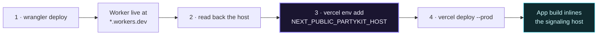

One command handles all of it:

```bash
npx wrangler login     # interactive, once
vercel login           # interactive, once
npm run deploy
```

Deploying the app first would bake `localhost` into the client bundle, and every
call would fail with no visible error.

<details>
<summary><b>Manual steps, and the two gotchas</b></summary>

```bash
npx wrangler deploy                                    # note the *.workers.dev host
echo "<that-host>" | vercel env add NEXT_PUBLIC_PARTYKIT_HOST production
vercel deploy --prod
```

**Gotcha 1 — TLS on a fresh subdomain.** A brand-new `workers.dev` subdomain takes
a few minutes for Cloudflare to issue its certificate. Until then it fails the TLS
handshake. Wait and retry; the deploy did not fail.

**Gotcha 2 — Vercel Deployment Protection.** It is **on by default** for new
projects and 302-redirects every visitor to a Vercel login, which breaks a public
demo. Turn it off under *Project → Settings → Deployment Protection*.

</details>

---

## Browser support

| Browser | Calls | Screen share | Notes |
|---|:---:|:---:|---|
| Chrome / Edge 90+ | ✅ | ✅ | Reference target |
| Brave | ✅ | ✅ | Shields may block STUN — allow-list the site if ICE fails |
| Firefox 90+ | ✅ | ✅ | No `setSinkId`, so speaker selection is hidden |
| Safari 15.4+ | ✅ | ✅ | Autoplay needs the muted-video path already used |
| iOS Safari 15.4+ | ✅ | ❌ | iOS has no `getDisplayMedia` at all |
| Android Chrome | ✅ | ⚠️ | Works, but awkward on small screens |

Unsupported capabilities hide their control rather than erroring.

---

## Known limitations

These are deliberate trade-offs, not unfinished work.

1. **Six participants maximum.** Mesh upload cost is `n-1` copies of your video.
2. **No TURN server by default.** ~10–20% of connections fail on symmetric NAT or
   restrictive corporate networks. STUN alone cannot fix this; TURN costs bandwidth
   someone must pay. Supply credentials via env to close the gap.
3. **Chat history does not persist.** Nothing stores it — inherent to P2P.
4. **No recording.** There is no server-side stream to record.
5. **Rooms are link-secured.** Anyone with the link can join; no accounts, no lobby
   approval.
6. **No host controls.** No mute-others or kick; everyone is equal.
7. **Two build-time `npm audit` advisories** in `postcss`, transitive under Next 15.
   Build-time only, never shipped to the browser; the fix requires Next 16.
8. **Recording captures your own stream only.** Recording every participant
   would mean compositing remote video onto a canvas and mixing their audio —
   a different feature. The UI says "Recording locally" rather than implying
   it captures the room.
9. **Whiteboard and chat have no late-join sync.** A participant who joins
   after a stroke is drawn will not see it, because nothing stores it. This is
   inherent to serverless P2P state, not an oversight.
10. **File transfers fan out per peer.** In a 6-person room a 100 MB file is
    uploaded five times. Mesh has no relay to deduplicate through.

---

## Roadmap

- [ ] **SFU fallback above 6 people** — mesh for small calls, mediasoup/LiveKit above
- [ ] **Simulcast** — send multiple resolutions so each peer gets what it can handle
- [ ] **Short-lived TURN credentials** issued from a route handler
- [ ] **`getStats()` diagnostics panel** — live RTT, jitter, loss, candidate pair
- [ ] **Virtual backgrounds** via `MediaStreamTrackProcessor` + WebGL
- [ ] **Reconnect-into-room** so a refresh rejoins instead of leaving
- [ ] **CRDT whiteboard state** so late joiners receive the board
- [ ] **Composited recording** of the full grid via canvas + Web Audio mixing
- [ ] **E2EE with insertable streams** for SFU mode

---

## Further reading

| Document | Contents |
|---|---|
| [`docs/WEBRTC.md`](docs/WEBRTC.md) | WebRTC explained through this codebase — every concept linked to the file that uses it |
| [`docs/PORTFOLIO.md`](docs/PORTFOLIO.md) | Project write-ups, résumé bullets, 12 interview questions with answers |
| [`docs/diagrams/`](docs/diagrams) | D2 sources for the architecture figures |

---

## License

MIT — see [LICENSE](LICENSE).
